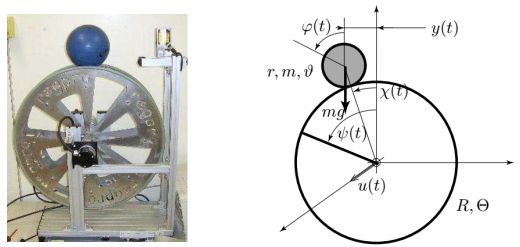

# Modelling and PID Controller Design of the Ball on Wheel problem

The notebook [ball_on_wheel.ipynb](ball_on_wheel.ipynb) presents the final project for the undergraduate course "Control I" from the Mechatronics Engineering degree course at Universidade de são Paulo. 

It consists in the modelling and design of a PID controller for the Ball on Wheel problem, shown bellow. Additionally, an introductory overview and an extensive analysis of the obtained results are provided.

 

Remark: the text content of the notebook was automatically translated to English, given that it was originally written in Portuguese. Therefore, eventual errors should be ignored.
